# APP_FLOW.md — Application Flow
## Timetable Scheduler

Source of truth: `PRD.md`, `TRD.md`. This document maps every user journey and system behavior so an AI coding tool can implement navigation, state transitions, and screen logic correctly.

---

## 1. Application Overview

The application has two journeys that share one login screen but diverge completely afterward:

- **Admin journey**: guided setup wizard on first use → ongoing master data management → generate → review/edit → unpublish/publish cycle.
- **Viewer journey** (Student or Teacher): login → land directly on a read-only timetable view, scoped automatically to what's relevant to them.

There are no settings screens and no notifications in v1 — all configuration happens through the setup wizard and master data screens, and all "what changed" awareness happens by the viewer simply reloading their timetable view.

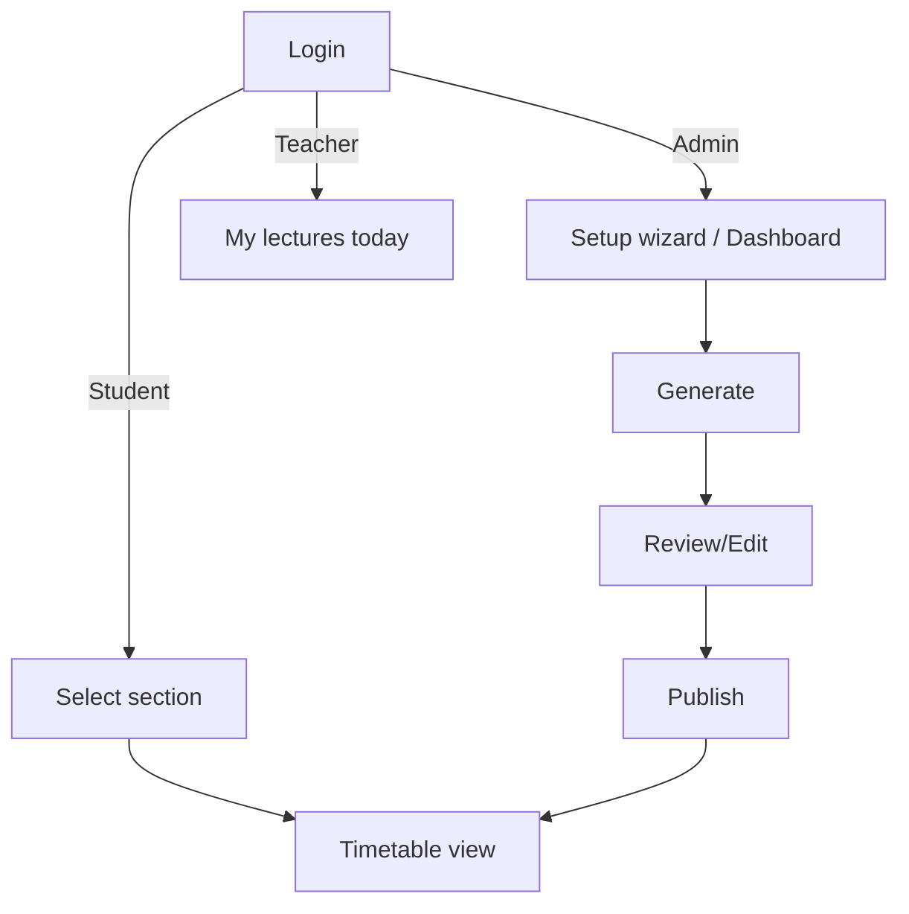

---

## 2. User Roles

### Admin
- **Entry point**: shared login screen → redirected to setup wizard (first login) or dashboard (returning)
- **Available screens**: setup wizard, dashboard, master data (rooms, teachers, subjects, sections), generate, timetable editor, publish, export
- **Actions**: full CRUD on master data, CSV import, generate, manually edit, unpublish/publish, export
- **Permissions**: full read/write on all college data (single-college scope)
- **Exit points**: logout (top-nav), session expiry

### Student (Viewer)
- **Entry point**: shared login screen → section selector (first login) → timetable view
- **Available screens**: section selector, timetable view (own section, published only), export
- **Actions**: view timetable, switch section (if applicable to them), export/print
- **Permissions**: read-only, published timetables only
- **Exit points**: logout

### Teacher (Viewer)
- **Entry point**: shared login screen → "My lectures today" (default, auto-filtered, no selection needed)
- **Available screens**: "My lectures today" (default), full section timetable view (same capability as Student), export
- **Actions**: view own filtered schedule, switch to browsing any section's full timetable, export/print
- **Permissions**: read-only, published timetables only
- **Exit points**: logout

---

## 3. Authentication Flow

| Flow | Trigger | User action | System response | Next state | Success state | Failure state |
|---|---|---|---|---|---|---|
| Login | User opens app | Enter email/password, submit | Supabase Auth validates credentials | Role check | Redirect: Admin → dashboard/wizard, Student → section selector, Teacher → "my lectures today" | Invalid credentials → inline error, stay on login |
| Logout | Click logout | Confirm | Session/token cleared | Redirect to shared login screen | Login screen shown | N/A |
| Session expiry | Any authenticated request with expired session | (passive) | Server returns 401 | Redirect to login | Login screen shown, then normal flow resumes after re-login | N/A |
| Unauthorized access | Viewer navigates to an Admin-only route | (passive) | Server-side role check rejects | Redirect to viewer's default screen | N/A | Generic "not authorized" message shown briefly |

**Invalid login**: inline error under the form ("Incorrect email or password"), no redirect, form retains the entered email.

**Unauthorized access**: enforced server-side (per TRD §7) regardless of what the frontend shows — a Viewer directly hitting `/admin/*` is redirected, never shown admin UI even briefly.

---

## 4. Onboarding / Setup Flow (Admin, guided)

Triggered automatically on an Admin's first login when no master data exists yet. A linear, step-by-step wizard — each step must be completed (or explicitly skipped, where valid) before moving to the next.

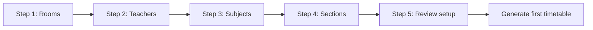

| Step | Trigger | User action | System response | Success state | Failure state |
|---|---|---|---|---|---|
| 1. Rooms | Wizard start | Add rooms manually or CSV import | Validates + saves | Advances to Step 2 | Invalid CSV rows shown inline, blocks advance until fixed |
| 2. Teachers | Step 1 complete | Add teachers manually or CSV import | Validates + saves | Advances to Step 3 | Same as above |
| 3. Subjects | Step 2 complete | Add subjects (with weekly hour requirements) manually or CSV import | Validates + saves | Advances to Step 4 | Same as above |
| 4. Sections | Step 3 complete | Add sections/classes | Validates + saves | Advances to Step 5 | Same as above |
| 5. Review | Step 4 complete | Review summary of all entered data | Displays counts and any warnings (e.g. zero rooms) | Advances to Generate | Admin can go back to any prior step to fix data |

Returning Admins (setup already complete) skip the wizard entirely and land on the dashboard.

---

## 5. Dashboard Flow (Admin)

- **Trigger**: Admin login (setup already complete)
- **Displays**: quick counts (subjects, teachers, rooms, sections), timetable status per section (draft/published/unpublished), shortcuts to generate/edit/master data
- **User action**: select a section to work on, or jump to master data
- **Next state**: section-scoped generate/edit screen, or a master data screen
- **Empty state**: if a section has no timetable yet, show "Generate timetable" as the primary action for that section

---

## 6. Master Data Flow

Applies to **rooms, teachers, subjects, sections** — same pattern for each, accessible both during the wizard and later from the dashboard.

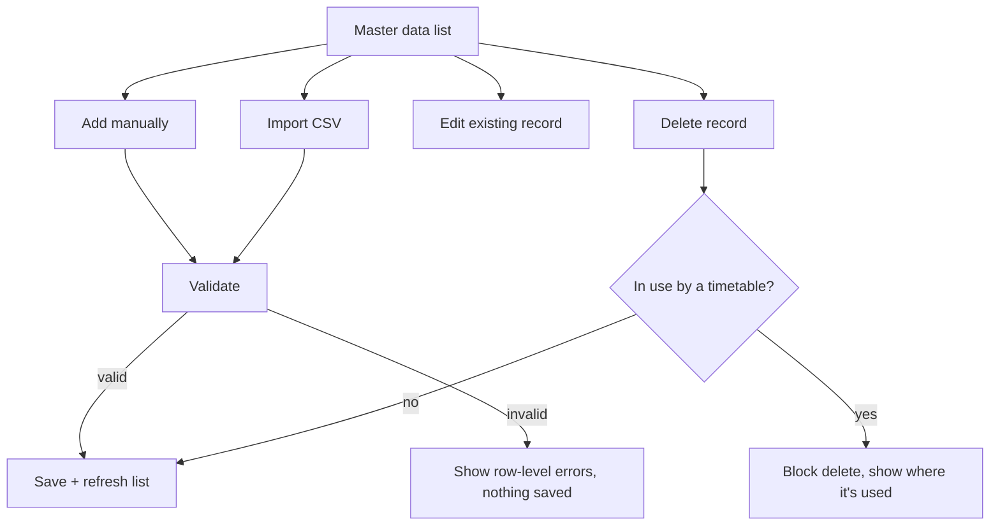

- **Trigger**: Admin opens a master data screen (Rooms / Teachers / Subjects / Sections)
- **User action**: add (manual or CSV), edit, delete
- **System response**: validate → save; CSV import is all-or-nothing per the TRD (reject invalid rows, no partial import)
- **Success state**: list refreshes, new/updated data available immediately for generation
- **Failure state**: row-level CSV errors displayed inline; delete blocked with a clear reason if the record is referenced by an existing timetable entry

---

## 7. Timetable Generation Flow

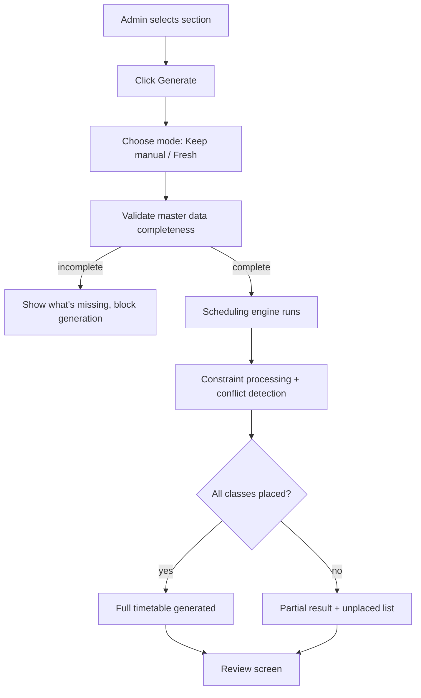

| Stage | Trigger | System response | Next state |
|---|---|---|---|
| Input | Admin clicks Generate, picks mode | Fetches subjects/teachers/rooms/constraints for the section | Validation |
| Validation | — | Checks minimum data exists (at least one room, teacher assigned per subject, etc.) | Blocks with a specific message if incomplete |
| Constraint processing | — | Sorts subjects by weekly-hour requirement (most-constrained-first, per TRD §5) | Scheduling |
| Scheduling | — | Backtracking placement into grid | Conflict detection (inline, same pass) |
| Conflict detection | — | HashMap check before every placement | Optimization |
| Optimization | — | Spreads subject periods across days, balances teacher daily load | Result |
| Result | — | Full or partial placement | Review screen |
| Review | Admin views result | Displays grid + any unplaced classes list | Editing flow or Conflict resolution flow |

**Success state**: 100% placed, zero conflicts — grid shown, ready to publish.
**Failure/partial state**: unplaced classes listed with reason (per TRD §5) — feeds directly into the Conflict Resolution Flow (§9).

---

## 8. Timetable Editing Flow (Admin, drag-and-drop)

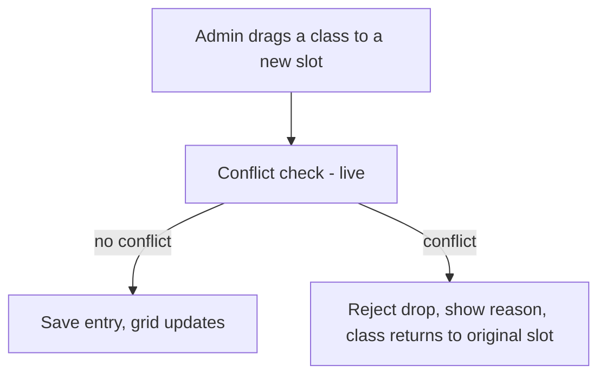

- **Trigger**: Admin drags a placed class card to a different day/period cell on the review grid
- **User action**: drop the card
- **System response**: same conflict-check logic as generation (TRD §5) runs against the live grid state before allowing the drop
- **Success state**: entry updates, grid re-renders immediately
- **Failure state**: card snaps back to its original position, inline message states the specific conflict (e.g. "Teacher already booked at this time")

---

## 9. Conflict Resolution Flow (unplaced classes)

Unplaced classes from generation (§7) appear as a distinct, visually flagged list alongside the grid — not a separate screen.

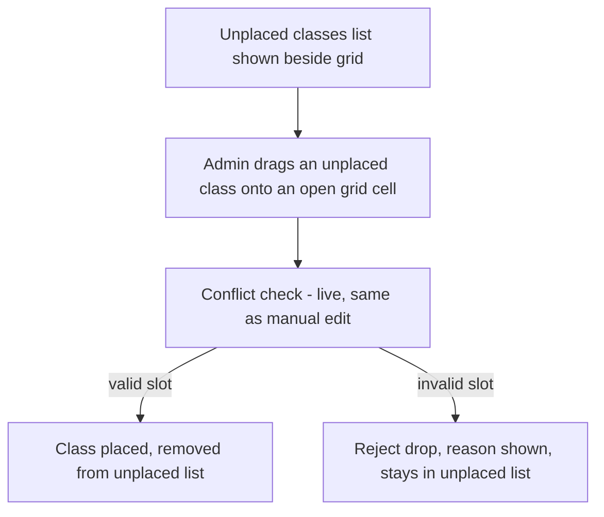

- **Trigger**: generation returns one or more unplaced classes
- **User action**: drag an unplaced class card directly from the list onto any open grid cell
- **System response**: identical conflict-check as the editing flow (§8) — no separate resolution logic to maintain
- **Success state**: unplaced list shrinks as each class is manually placed; empty list means the timetable is fully resolved and publishable
- **Failure state**: invalid drop target rejected with the specific reason, class remains in the unplaced list

---

## 10. Publish Flow

Publishing follows an explicit unpublish-then-publish cycle, per your confirmation — a timetable is either "published" (locked, visible to viewers) or "draft" (editable, not visible to viewers). There is no simultaneous edit-while-published state.

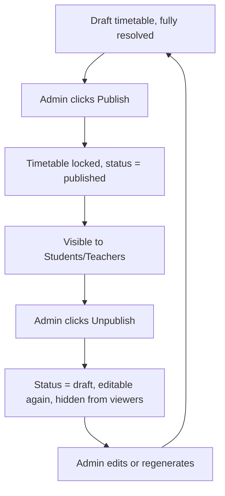

| Stage | Trigger | User action | System response | Next state | Failure state |
|---|---|---|---|---|---|
| Publish | Draft fully resolved (no unplaced classes) | Click Publish | Locks entries, sets status = published | Visible to viewers immediately | Blocked if unplaced classes remain — must resolve first |
| Unpublish | Published timetable needs changes | Click Unpublish | Sets status = draft, hides from viewers | Editable again | N/A |

**Important rule**: Publish is blocked while any unplaced classes remain — this enforces that viewers never see an incomplete schedule.

---

## 11. Export / Print Flow

- **Trigger**: any role, on a viewable timetable (published only, for Viewers; draft or published, for Admin)
- **User action**: click Export
- **System response**: renders the current grid to a printable/PDF-friendly layout
- **Success state**: file downloads or print dialog opens
- **Failure state**: export disabled with a tooltip if no timetable exists yet for that section

---

## 12. Error & Empty-State Flows

| Situation | Screen | Behavior |
|---|---|---|
| No master data yet (new Admin) | Dashboard | Redirects into setup wizard automatically |
| Section has no timetable yet | Timetable view (Admin) | "Generate timetable" primary action shown |
| Section has no *published* timetable yet | Timetable view (Viewer) | "Timetable not published yet" message, no grid shown |
| CSV import fails validation | Master data screen | Row-level errors listed, nothing saved, no partial import |
| Generate fails validation (missing data) | Generate screen | Specific missing-data message (e.g. "No rooms defined"), generation blocked |
| Manual edit / conflict-resolution drop rejected | Grid | Card snaps back, inline conflict reason shown |
| Publish attempted with unplaced classes | Review screen | Publish button disabled/blocked with explanation |
| Session expired mid-action | Any screen | Redirect to login, action is not silently retried |

---

## 13. Complete User Journey

### Admin (first-time)
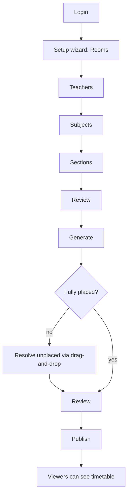

### Admin (returning, making a change)
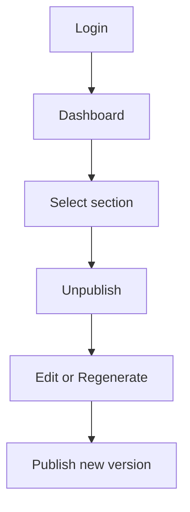

### Student
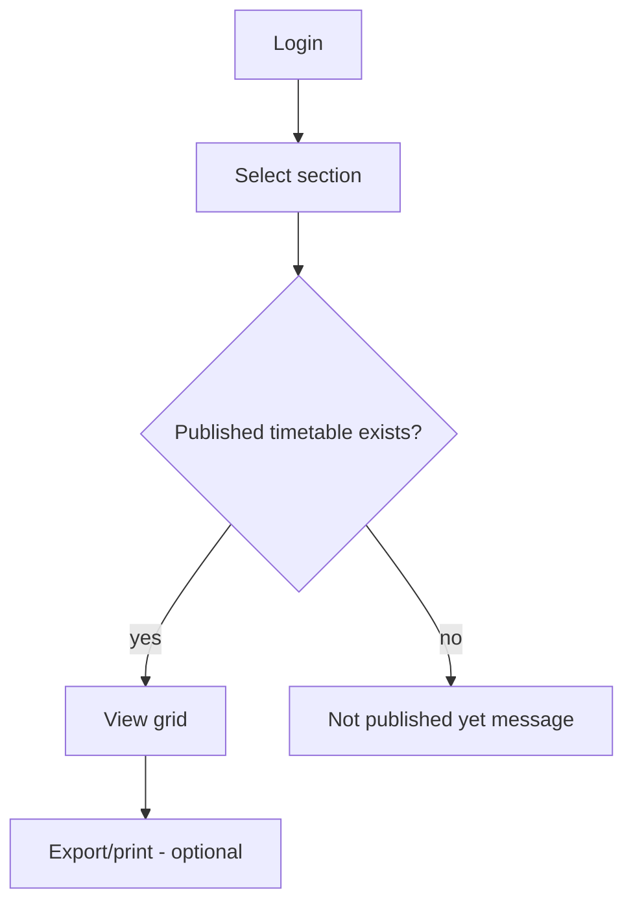

### Teacher
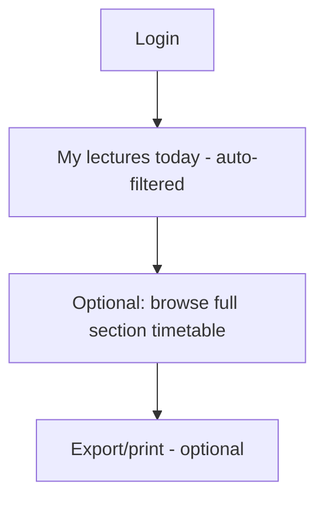
