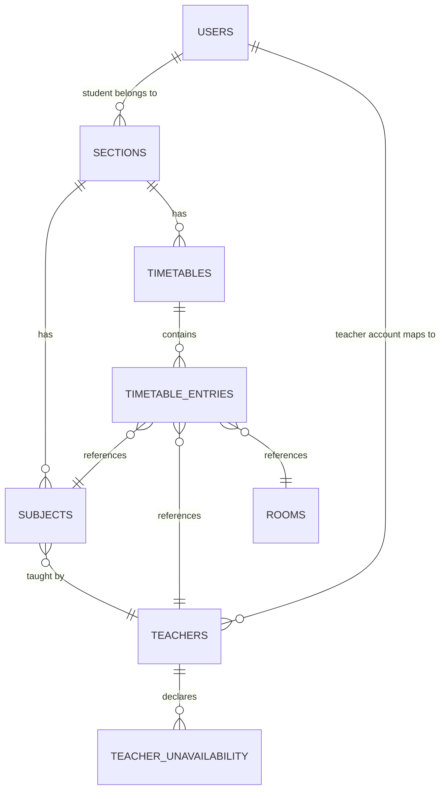

# SCHEMA.md — Database Architecture
## Timetable Scheduler

Source of truth: `PRD.md`, `TRD.md`, `APP_FLOW.md`. Defines the complete data model for a single-college, single-tenant deployment (per TRD §1).

---

## 1. Database Choice

**Supabase Postgres** (per TRD §2) — relational integrity is essential here: conflict-free scheduling depends on hard uniqueness constraints at the database level as a last-resort safety net beneath the application-level conflict checker (TRD §8). Postgres's native support for unique composite constraints, foreign keys, and Row-Level Security (for role-based read access) covers every requirement without added infrastructure.

---

## 2. Entity Relationship Overview



---

## 3. Entities

### `users`
Managed primarily by Supabase Auth; this table extends it with role/profile data.

| Field | Type | Constraints |
|---|---|---|
| `id` | uuid | PK, references `auth.users.id` |
| `email` | text | unique, not null |
| `full_name` | text | not null |
| `role` | text | not null, enum: `admin`, `student`, `teacher` |
| `section_id` | uuid | FK → `sections.id`, nullable (set for `student` role only, chosen at first login per `APP_FLOW.md` §4) |
| `teacher_id` | uuid | FK → `teachers.id`, nullable (set for `teacher` role only, links login to their teacher record) |
| `created_at` | timestamptz | default `now()` |

### `sections`
| Field | Type | Constraints |
|---|---|---|
| `id` | uuid | PK |
| `name` | text | not null (e.g. "AI III-B") |
| `created_at` | timestamptz | default `now()` |

### `rooms`
| Field | Type | Constraints |
|---|---|---|
| `id` | uuid | PK |
| `name` | text | not null, unique (e.g. "Room 204") |
| `type` | text | not null, enum: `lecture`, `lab` |
| `capacity` | integer | nullable |
| `created_at` | timestamptz | default `now()` |

### `teachers`
| Field | Type | Constraints |
|---|---|---|
| `id` | uuid | PK |
| `name` | text | not null |
| `email` | text | unique, nullable (may not all have login accounts) |
| `created_at` | timestamptz | default `now()` |

### `subjects`
| Field | Type | Constraints |
|---|---|---|
| `id` | uuid | PK |
| `name` | text | not null |
| `section_id` | uuid | FK → `sections.id`, not null |
| `teacher_id` | uuid | FK → `teachers.id`, not null |
| `type` | text | not null, enum: `lecture`, `lab` — drives card structure per `DESIGN.md` §8, **and** is a hard constraint in the scheduling engine: a `lab` subject may only be placed in a `rooms.type = lab` room (per `TRD.md` §5, `RULES.md`) |
| `weekly_hours` | integer | not null, > 0 — drives most-constrained-first ordering (TRD §5) |
| `created_at` | timestamptz | default `now()` |

### `timetables`
| Field | Type | Constraints |
|---|---|---|
| `id` | uuid | PK |
| `section_id` | uuid | FK → `sections.id`, not null |
| `status` | text | not null, enum: `draft`, `published`, default `draft` |
| `version` | integer | not null, default 1 (incremented on each publish, per unpublish→publish cycle in `APP_FLOW.md` §10) |
| `created_at` | timestamptz | default `now()` |
| `updated_at` | timestamptz | default `now()` |

### `timetable_entries`
The core scheduled-class record — one row per placed class.

| Field | Type | Constraints |
|---|---|---|
| `id` | uuid | PK |
| `timetable_id` | uuid | FK → `timetables.id`, not null |
| `subject_id` | uuid | FK → `subjects.id`, not null |
| `teacher_id` | uuid | FK → `teachers.id`, not null |
| `room_id` | uuid | FK → `rooms.id`, not null |
| `day` | smallint | not null, 1–6 (Mon–Sat, per college calendar) |
| `period` | smallint | not null, matches the college's fixed period numbering |
| `is_locked` | boolean | not null, default `false` — set `true` for manually-placed entries so "Keep manual" regeneration mode (TRD §5) treats them as pre-filled. **Not the same concept as a published timetable being non-editable** — that state comes entirely from `timetables.status = published`, per `APP_FLOW.md` §10. An entry can be `is_locked = true` in an otherwise-draft timetable, and every entry becomes effectively non-draggable once the parent timetable is published, regardless of this field. |
| `created_at` | timestamptz | default `now()` |

### `teacher_unavailability`
Supports the TRD's open question on modeling explicit unavailable windows. Included now as a lightweight, optional-to-populate table rather than deferred, since it costs little and the scheduling engine's constraint-processing step already needs a slot-availability check — better to have the structure ready than to migrate it in later.

| Field | Type | Constraints |
|---|---|---|
| `id` | uuid | PK |
| `teacher_id` | uuid | FK → `teachers.id`, not null |
| `day` | smallint | not null, 1–6 |
| `period` | smallint | not null |
| `created_at` | timestamptz | default `now()` |

---

## 4. Relationships

- A **section** has many **subjects** and exactly one **timetable** at a time (one active draft/published record per section — history is not versioned as separate rows, only the `version` counter increments, per MVP discipline).
- A **subject** belongs to one **section** and is taught by one **teacher** — matches the PRD's "every subject just assigned to a section" scope (no elective/multi-teacher modeling in v1).
- A **timetable** has many **timetable_entries** — this is the actual grid data.
- Each **timetable_entry** references one **subject**, one **teacher**, and one **room** — teacher and room are denormalized onto the entry (not derived solely via `subject.teacher_id`) so a manual edit can reassign a substitute teacher or alternate room for a single occurrence without altering the subject's default assignment.
- A **student** user links to one **section** (self-selected). A **teacher** user links to one **teachers** row (their own record), giving them the filtered "my lectures today" view by matching `timetable_entries.teacher_id`.

---

## 5. Indexes

| Table | Index | Reason |
|---|---|---|
| `timetable_entries` | `(teacher_id, day, period)` | Conflict lookups (TRD §5) filter on this constantly |
| `timetable_entries` | `(room_id, day, period)` | Same — room conflict checks |
| `timetable_entries` | `(timetable_id)` | Fetching a full grid for a section |
| `subjects` | `(section_id)` | Fetching a section's subject list during generation |
| `teacher_unavailability` | `(teacher_id, day, period)` | Constraint-processing lookup during generation |
| `users` | `(section_id)`, `(teacher_id)` | Resolving a logged-in viewer's scope |

---

## 6. Constraints

Database-level uniqueness as the last-resort safety net beneath application-level conflict checking (TRD §8):

```sql
-- A teacher cannot be double-booked within the same published/draft timetable's active entries
ALTER TABLE timetable_entries
  ADD CONSTRAINT uniq_teacher_slot UNIQUE (teacher_id, day, period, timetable_id);

-- A room cannot be double-booked within the same timetable
ALTER TABLE timetable_entries
  ADD CONSTRAINT uniq_room_slot UNIQUE (room_id, day, period, timetable_id);

-- A section cannot have two subjects in the same slot within its own timetable
ALTER TABLE timetable_entries
  ADD CONSTRAINT uniq_section_slot UNIQUE (timetable_id, day, period);
```

Note: constraints are scoped per `timetable_id`, since each section has its own timetable and teachers/rooms are checked for conflicts only within realistic overlapping schedules (cross-section teacher/room conflicts are checked at the application layer across all *active* timetables, since a single teacher can teach multiple sections — the DB constraint alone can't express "across all currently-draft timetables," so the engine's HashMap check remains the primary defense there, per TRD §5).

---

## 7. Validation Rules

- `subjects.weekly_hours` must be a positive integer (enforced via `CHECK (weekly_hours > 0)`)
- `rooms.type` and `subjects.type` must be one of the defined enum values (`CHECK` constraint or Postgres `enum` type)
- `users.role` must be one of `admin`, `student`, `teacher`
- A `student` user must have a non-null `section_id`; a `teacher` user must have a non-null `teacher_id` (enforced at the application layer during account setup, since conditional-null-by-role isn't cleanly expressed as a single `CHECK` constraint)
- `timetables.status` transitions only `draft → published → draft` (enforced at the application layer per the explicit unpublish-then-publish cycle in `APP_FLOW.md` §10 — no direct `draft → published` skip allowed if unplaced classes exist, checked before the transition)

---

## 8. Example Records

**`subjects`**
```json
{ "id": "…", "name": "Operating Systems", "section_id": "…", "teacher_id": "…", "type": "lecture", "weekly_hours": 4 }
{ "id": "…", "name": "DS Lab", "section_id": "…", "teacher_id": "…", "type": "lab", "weekly_hours": 2 }
```

**`timetable_entries`**
```json
{ "id": "…", "timetable_id": "…", "subject_id": "…", "teacher_id": "…", "room_id": "…", "day": 1, "period": 1, "is_locked": false }
```

**`users` (teacher account)**
```json
{ "id": "…", "email": "teacher@college.edu", "full_name": "…", "role": "teacher", "section_id": null, "teacher_id": "…" }
```

---

## 9. Migration Strategy

- All schema changes go through Supabase's migration files (`supabase/migrations/`), never manual dashboard edits, so schema history is versioned alongside the codebase.
- Order of initial migration: `sections` → `rooms` → `teachers` → `subjects` → `timetables` → `timetable_entries` → `teacher_unavailability` → `users` (last, since it has FKs into `sections` and `teachers`).
- Row-Level Security policies (per TRD §7) are added in a follow-up migration after tables exist, with default-deny and explicit per-role read policies layered in.
