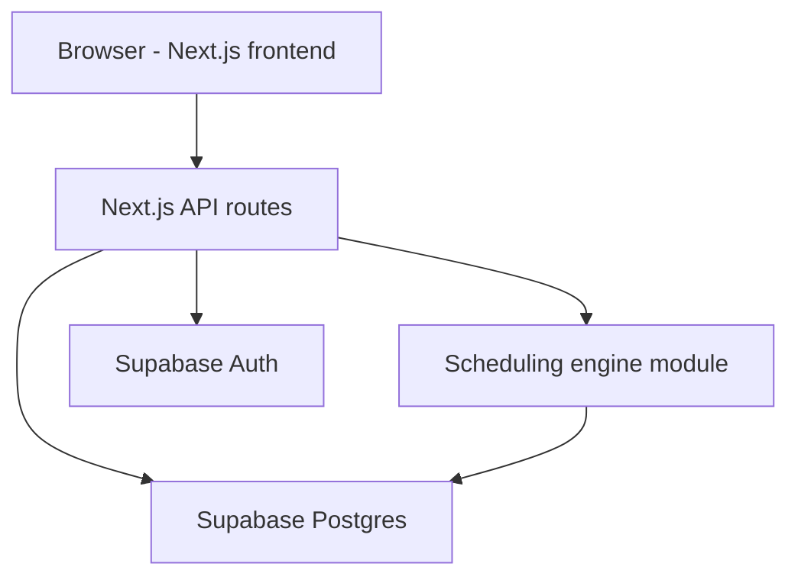
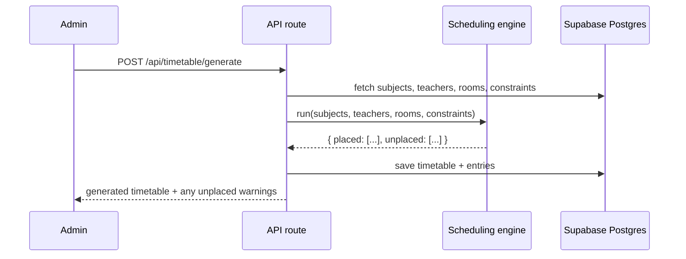
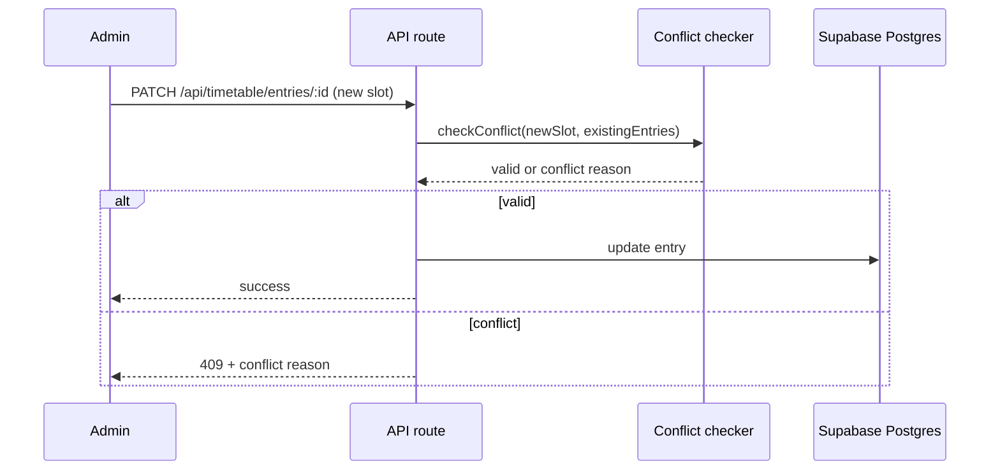

# TRD.md — Technical Requirements Document
## Timetable Scheduler

Refer to `PRD.md` for product requirements. Refer to `SCHEMA.md` (to be generated) for the full database design. This document translates product requirements into an implementable technical specification for a single college, single-department-scope tool.

---

## 1. Technical Overview

**System purpose**: A web application that lets a college admin set up subjects, teachers, rooms, and constraints, then automatically generates a conflict-free weekly timetable, with support for manual edits and controlled regeneration.

**Technical goals**:
- Deterministic, explainable scheduling (no black-box AI for the core algorithm)
- Simple enough to build and maintain with an AI coding assistant (Cursor) by a solo/beginner developer
- Real authentication with three roles (Admin, Student, Teacher — Student and Teacher are both read-only "Viewer" permission tiers but have distinct default landing views, per `APP_FLOW.md` §2)
- Single college, single tenant — no multi-tenant complexity in v1

**Architecture overview**: A single Next.js application handles both frontend (React) and backend (API routes), backed by Supabase (Postgres + Auth). The scheduling engine is a self-contained TypeScript module with no external dependencies, callable from an API route.



---

## 2. Recommended Tech Stack

| Layer | Choice | Why |
|---|---|---|
| Frontend | Next.js 14 (React, TypeScript, App Router) | One framework for UI + API, huge Cursor/AI-tool familiarity, minimal config |
| Backend | Next.js API routes (REST) | No separate backend service to deploy or reason about — simplest path for a beginner |
| Database | Supabase Postgres | Managed Postgres with built-in auth, generous free tier, works natively with Next.js |
| Authentication | Supabase Auth (email/password) | Real login out of the box, no custom auth code to write or secure |
| Styling | Tailwind CSS | Fast to build with, AI tools generate clean Tailwind reliably |
| CSV import | `papaparse` (client-side) | Lightweight, well-documented, avoids a server-side file-processing service |
| Scheduling engine | Hand-written TypeScript (no library) | The core DS/algorithm content of the project — must stay transparent and hand-authored, not delegated to a black-box package |
| Testing | Vitest (unit/logic) + Playwright (light E2E) | Vitest is fast and simple for testing the scheduler; Playwright only for a couple of critical user flows, not full coverage in v1 |
| Deployment | Vercel | Zero-config Next.js deploys, free preview deployments per branch — matches your "preview environment" need with no extra setup |

**REST over tRPC**: chosen specifically because it's simpler to reason about for someone new to full-stack development — plain HTTP endpoints with JSON, no extra type-generation layer to debug.

---

## 3. System Architecture

### Major components

| Component | Responsibility |
|---|---|
| Auth module | Login, session handling, role checks (via Supabase Auth) |
| Master data module | CRUD + CSV import for subjects, teachers, rooms, sections |
| Scheduling engine | Pure function: takes master data + constraints, returns a timetable or a partial result with unplaced classes |
| Timetable API | Orchestrates: fetch data → call engine → save result → return to frontend |
| Manual edit module | Validates a single proposed change against live constraints before saving |
| Dashboard/view module | Renders the weekly grid for both roles, read-only for Student/Teacher |

### Data flow (generation)



### Data flow (manual edit)



---

## 4. Backend Requirements

**Services** (implemented as API route groups, not separate microservices):
- `auth` — login/session (delegated mostly to Supabase client SDK)
- `master-data` — subjects, teachers, rooms, sections CRUD + CSV import
- `timetable` — generate, fetch, publish
- `entries` — manual edit of individual slot assignments

**Business logic placement**: all scheduling/conflict logic lives in `/lib/scheduler` as pure, framework-independent TypeScript functions — no database or HTTP calls inside the engine itself. API routes are thin wrappers that fetch data, call the engine, and persist results. This keeps the engine unit-testable in isolation.

**Validation**: every API route validates its input shape (using `zod`) before touching the database or engine.

**Error handling**: consistent JSON error shape across all routes:
```json
{ "error": { "code": "CONFLICT", "message": "Room 204 is already booked at this time" } }
```

---

## 5. Scheduling Engine

**Approach**: deterministic Constraint Satisfaction Problem (CSP) solver using **backtracking with the Most-Constrained-Variable-First heuristic** — not AI/ML. This is the right tool because timetabling has explicit hard rules (never violate) and the goal is a provably valid schedule, not a probabilistic guess.

**Why not AI here**: an LLM or ML model can't guarantee zero constraint violations and would need the same validation logic anyway. A deterministic algorithm is faster, fully explainable, and testable with fixed inputs/outputs.

### Hard constraints (must never be violated)
- A teacher cannot be scheduled in two places in the same period
- A room cannot host two classes in the same period
- A section cannot have two subjects in the same period
- Fixed/unavailable slots (breaks, lunch, teacher's declared unavailable windows) are never used
- A subject with `type = lab` may only be placed in a room with `type = lab` (resolves `PRD.md` §7 Q2 — room type is a hard constraint, not just a display distinction)

### Soft constraints (optimized, may be relaxed if needed)
- **Subject weight balancing**: subjects are sorted by required weekly hours, descending, before placement begins (most-constrained-first). A subject needing 6 periods/week is placed before one needing 2 — this gives "harder" subjects first pick of open slots, which is why it solves your question about subjects needing more lectures.
- **Spread, not stacking**: for any subject requiring N periods/week, the engine prefers placing them on N different days before allowing two periods of the same subject on the same day.
- **Balanced teacher load per day**: the engine avoids assigning a teacher 5+ consecutive periods when a lighter distribution is possible.

### Conflict detection
A single `HashMap<teacherId|roomId|sectionId + day + period, boolean>` is built and checked in O(1) before every placement — this is the same conflict-checking logic reused for both auto-generation and manual edits, so behavior is consistent everywhere.

### Regeneration behavior
On "Regenerate," the frontend prompts the admin with two options:
- **Keep manual placements** — locked/manually-placed entries are treated as pre-filled hard constraints; the engine only fills the remaining empty slots.
- **Start fresh** — all entries are cleared and the engine runs from scratch.

### Failure handling
If the engine cannot place every class (e.g. insufficient rooms/periods for the given constraints), it does not fail silently or crash. It returns a partial result: `{ placed: [...], unplaced: [{ subject, reason }] }`. The UI surfaces unplaced classes as a clear checklist so the admin can manually place them or adjust constraints.

---

## 6. API Requirements

| Method | Endpoint | Purpose | Auth |
|---|---|---|---|
| POST | `/api/auth/login` | Email/password login (Supabase-backed) | Public |
| GET | `/api/subjects` | List subjects | Admin, Viewer |
| POST | `/api/subjects` | Create subject | Admin |
| POST | `/api/subjects/import` | Bulk CSV import | Admin |
| GET | `/api/teachers` | List teachers | Admin, Viewer |
| POST | `/api/teachers` | Create teacher | Admin |
| GET | `/api/rooms` | List rooms | Admin, Viewer |
| POST | `/api/rooms` | Create room | Admin |
| GET | `/api/sections` | List sections | Admin, Viewer |
| POST | `/api/sections` | Create section | Admin |
| POST | `/api/timetable/generate` | Run scheduling engine | Admin |
| GET | `/api/timetable/:sectionId` | Fetch current timetable for a section | Admin, Viewer (own section) |
| PATCH | `/api/timetable/entries/:id` | Manually move one class, conflict-checked | Admin |
| POST | `/api/timetable/publish` | Lock and publish current timetable (blocked if unplaced classes remain) | Admin |
| POST | `/api/timetable/unpublish` | Unlock a published timetable back to draft for editing | Admin |

**Example — generate timetable**:
- **Request**: `{ "sectionId": "uuid", "mode": "keep_manual" | "fresh" }`
- **Response (success)**: `{ "placed": 42, "unplaced": [] }`
- **Response (partial)**: `{ "placed": 39, "unplaced": [{ "subject": "NTDM Lab", "reason": "No free lab room in remaining slots" }] }`
- **Validation**: `sectionId` must exist; `mode` must be one of the two enum values
- **Auth**: Admin only

All list/create endpoints follow the same validate → authorize → execute → respond pattern.

---

## 7. Authentication & Authorization

| Role | Permissions |
|---|---|
| Admin | Full CRUD on master data, generate/edit/publish timetables |
| Student | Read-only access to their self-selected section's published timetable |
| Teacher | Read-only access to their own filtered "my lectures today" view by default, plus browsing any section's published timetable |

- **Session handling**: Supabase Auth session cookies (handled by Supabase's Next.js SDK helpers) — no custom JWT logic to write.
- **Protected resources**: every write-capable API route checks the caller's role server-side before executing; the frontend also hides admin-only UI, but the server check is the actual security boundary.
- **Row-level security**: Supabase Postgres RLS policies enforce that a Student/Teacher can only read timetables for their own section, as a second layer beneath the API check.

---

## 8. Database Requirements

Full schema detail lives in `SCHEMA.md`. Summary for architectural context:

**Main entities**: `users`, `subjects`, `teachers`, `rooms`, `sections`, `timetables`, `timetable_entries`, `constraints` (fixed/unavailable slots).

**Relationships**: a `timetable` belongs to one `section`; each `timetable_entry` references one `subject`, one `teacher`, one `room`, and a `(day, period)` slot.

**Data integrity**: a unique constraint on `(teacher_id, day, period)` and `(room_id, day, period)` at the database level acts as a last-resort safety net even though the application layer already prevents conflicts — belt-and-suspenders against race conditions.

**Transactions**: saving a full generated timetable (many entries at once) is wrapped in a single database transaction so a partial write never leaves the timetable in a broken state.

**Indexing**: indexes on `teacher_id`, `room_id`, and `section_id` columns on `timetable_entries`, since conflict lookups filter on these constantly.

---

## 9. Security

- **Authentication security**: delegated entirely to Supabase Auth (industry-standard, handles password hashing, session tokens) — no custom auth code to get wrong.
- **Authorization**: enforced server-side on every API route, never trusted from the client.
- **Input validation**: all API inputs validated with `zod` schemas before use.
- **Secrets**: Supabase URL/keys stored in environment variables (`.env.local`, never committed); service-role key (if needed for admin operations) never exposed to the frontend.
- **API security**: rate limiting not required at college-project scale in v1, but all mutating endpoints require an authenticated session.
- **Data protection**: no sensitive personal data beyond names/emails is stored; standard Supabase encryption-at-rest applies.

---

## 10. Performance & Scalability

- **Expected workload**: single college, low hundreds of subjects/teachers/rooms, a handful of concurrent admin users — this is a low-traffic internal tool, not a consumer-scale product.
- **Response-time goals**: timetable generation under 5 seconds for a typical department-sized input (under 50 subjects); manual edit conflict-check under 300ms.
- **Scheduling performance**: backtracking is efficient at this scale because constraint density (teachers/rooms) is low relative to search space; no need for advanced optimization (simulated annealing, genetic algorithms) in v1.
- **Scalability considerations**: not designed for multi-college concurrent use in v1 — out of scope per PRD. If needed later, the engine itself doesn't need to change; only the data layer would need tenant scoping.

---

## 11. Error Handling

| Scenario | Handling |
|---|---|
| Invalid CSV format on import | Reject with row-level error messages, no partial import |
| Generation can't place all classes | Return partial result with unplaced list, not a hard failure |
| Manual edit creates a conflict | Block with 409 and a human-readable reason, no silent overwrite |
| Session expired | Redirect to login, preserve intended destination |
| Database write failure mid-transaction | Roll back entirely, surface a generic "couldn't save, try again" message |

---

## 12. Testing Requirements

- **Unit testing (Vitest)**: the scheduling engine is the highest-priority test target — fixed input sets with known valid/invalid outcomes, edge cases (insufficient rooms, impossible constraints).
- **Integration testing**: API routes tested against a local Supabase instance for the generate → save → fetch flow.
- **API testing**: basic request/response shape and auth-rejection tests for each endpoint.
- **Scheduling-engine testing**: this is not optional — every hard constraint needs at least one test that proves the engine never violates it, given adversarial input.
- **UI testing (Playwright, light)**: one E2E test for the critical path (login → generate → view grid) is enough for v1; broader UI coverage is a later investment.

---

## 13. Deployment

- **Development environment**: local Next.js dev server + Supabase local CLI or a free-tier Supabase project for shared dev data.
- **Preview environment**: Vercel automatically creates a preview deployment for every pull request/branch — this satisfies your need for a preview environment with zero extra configuration.
- **Production environment**: Vercel production deployment connected to the main branch, pointed at the production Supabase project.
- **Environment variables**: `NEXT_PUBLIC_SUPABASE_URL`, `NEXT_PUBLIC_SUPABASE_ANON_KEY`, `SUPABASE_SERVICE_ROLE_KEY` (server-only) — set separately per environment in Vercel's dashboard.
- **Build process**: standard `next build`, no custom build steps needed.

---

## 14. Technical Risks

| Risk | Mitigation |
|---|---|
| Backtracking performance degrades with poorly-structured constraints (e.g. way more classes than available slots) | Set a reasonable timeout/iteration cap in the engine; return partial results rather than hanging |
| CSV import format mismatches real-world data (headers, encoding) | Provide a downloadable template and validate strictly, with clear per-row errors |
| Manual edits and regeneration interacting unpredictably | "Keep manual" mode treats manual entries as hard-locked before the engine runs — no ambiguity |
| Beginner unfamiliarity with Supabase RLS policies causing accidental data exposure | Start with conservative default-deny RLS policies, add explicit read policies per role |

---

## 15. Open Technical Decisions

1. Exact period/day configuration — fixed defaults (matching your college's structure) vs admin-configurable at setup time.
2. Whether CSV import needs a column-mapping UI or a strict fixed template (simpler, recommended for v1).
3. Whether "unavailable" windows for teachers are modeled as a separate table now or added later if actually needed.
4. Exact backtracking iteration/timeout cap — needs a sensible default, tunable once real data is tested.
5. Whether Supabase RLS alone is sufficient or an additional API-layer check is worth the redundancy for peace of mind as a beginner.
